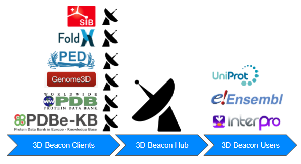

# Introduction
The protein structure is essential for the elucidation of protein function and the impacts of genetic variations. Both the number and the growth rate of experimental structures available in the PDB is orders of magnitude lower than those of available protein sequences in UniProtKB. To compensate the sparsity of experimental structures, the quality of predicted structures have been significantly enhanced recently which is shown in the recent CASP analyses. However there is no predicted method without errors. 3D-beacons provides a combined access to experimental and predicted structures with quality measurements to balance the coverage and accuracy.

# Infrastructure

3D-Beacon network is consisted of 
 1. One [hub](hub.md) collates the data from the Beacons and sends back to the user 
 2. Multiple [Beacons](beacon.md) each represents one data source
 3. Different users:
    1. Power users: use the [APIs](api.md) to do batch queries
    2. Simple users: visit the website to do the query

# Frequently Asked Questions
**Q:** Will the result be redundant, i.e. can there be several models for the same sequence/segment  
**A:** Yes, the hub will collate models returned from all selected beacons for a given query (UniProt accession, Interpro, Pfam etc). The models are ranked, with experimental models at the top, and then ranked by model quality, with protein ensembles at the bottom

**Q:** Do 3D Beacons provide quality information for the models?  
**A:** Of course, QMEAN is used to evaluate the models

**Q:** Will text/literature mining be provided?  
**A:** Sorry, they are not in plan at this point

**Q:** Do you have known user cases for me to understand 3D Beacons better?  
**A:** Yes, the user cases could be found [here](user-cases.md)
